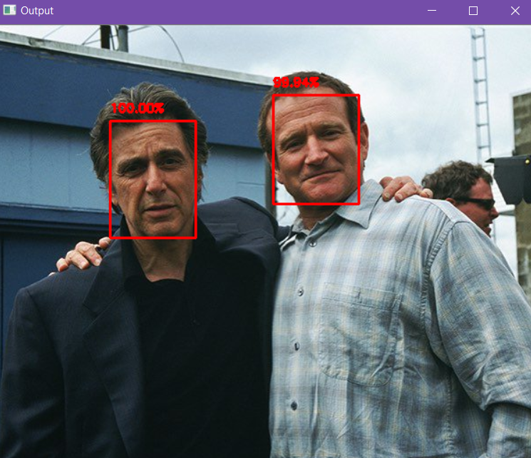
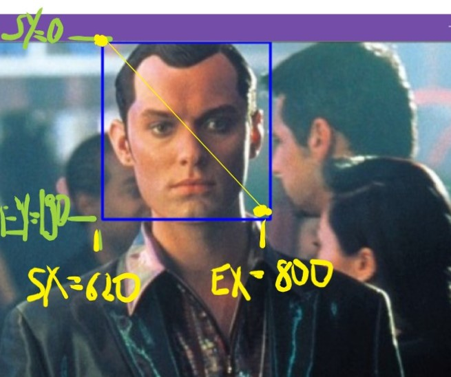
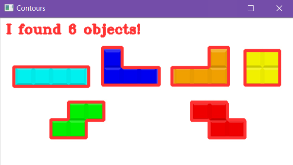

# Computer_Vision
Bu repo'da yüz/şekil/obje tanımlama, resimler üzerinde bazı temel işlemler geliştirme, cv2 veya imutils gibi kütüphaneleri daha iyi anlayabileceğim alıştırmalar yapıyorum.

face_detection kısmında iki farklı kaynaktan derlediğim yüz tanıma algoritmaları bulunmakta.

ikinci klasörde üzerinde çalıştığım opencv alıştırmaları bulunmakta. ROI, GlaussianBlur, rectangle, edge detection, erosions, delations ve daha birçok alıştırma içermekte.

